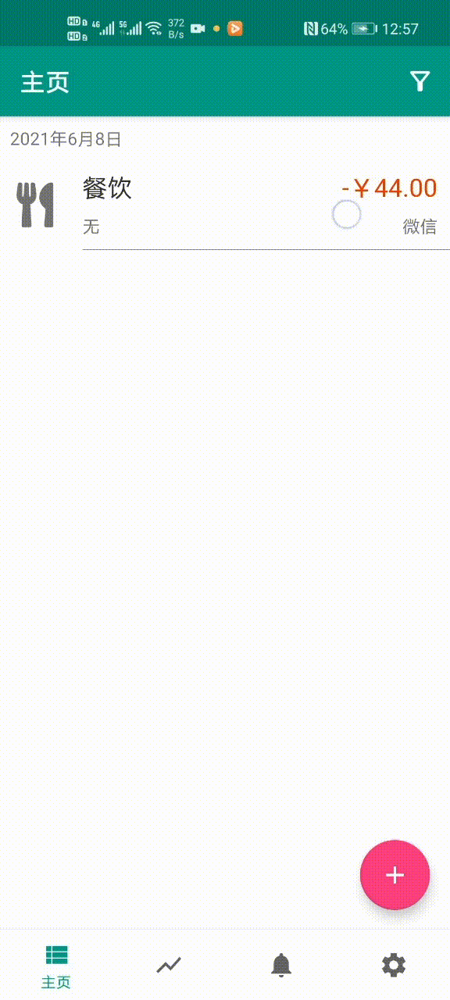

# Except-Pains Bookkeeping

安卓平台账单记录应用，特点功能有便捷入口、数据备份与导入、中英文语言支持。对于有“强迫症”的朋友，快捷入口可以提供快速记录的功能，允许记录不完整的内容以便后续补充；内置的截图功能还能附上屏幕截图，以便记录时能够看到具体信息。

从本应用导出支持CSV和数据库文件两种导出方式。从支付宝或微信导入则需要按照官方的教程申请导出CSV文件。

2023/1/15 更新：由于项目比较旧，移动端版本更迭快，项目中使用的有些功能已经被标记Deprecated，甚至还可能出现错误。操作系统越来越注重用户隐私，快接入口获取屏幕截图的方法今后可能会失效。

（仓库较大有两个原因，一是 `pics` 文件夹下的 gif 图较大，没有使用图床。二是 `app/libs` 下有很多没有使用远程仓库 URL 指明的第三方依赖。）

## 1 功能演示

### 1.1 收支记录

添加记录：

    

删除记录：

    

编辑记录：

    

筛选记录：

    

从快捷入口添加记录：

    

### 1.2 统计分析

进入图表页浏览内容：

    

### 1.3 数据备份

导入：

    

导出：

    

### 1.4 设置

设置页面：

    

设置页面右上角是软件使用说明的入口，下面两张图展示的说明的完整内容：

    

    

设置中还能编辑种类、来源等分类信息，比如下面是种类列表：

    

## 2 一月的改动

由于使用的依赖 **androidx.core:core:1.10.0-alpha01** 允许的最低SDK Version为33，因而将构建SDK版本修改了。对于以前没有合并好的问题也进行了处理。

## 3 构建问题

### 3.1 Kotlin 版本不对

解决方案：更新 Android Studio 的 Kotlin 插件为最新，并将 `build.gradle` 中的 `buildscript { ext.kotlin_version= }` 修改成相同的版本。
